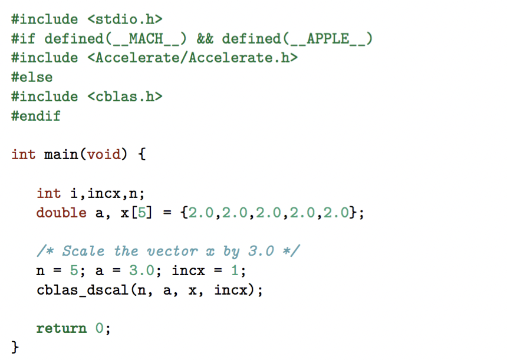
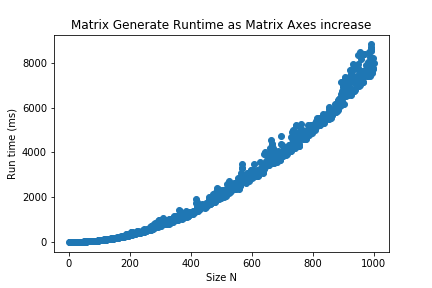
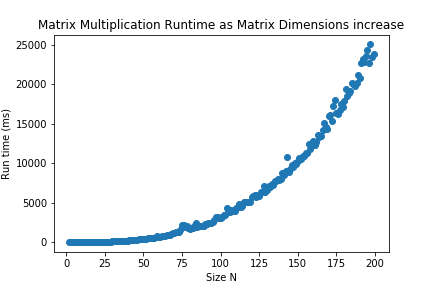

# HPC
Repo for HPC course at DTU

Piazza Link: https://piazza.com/class/jpwofdl793d7dd?cid=6
Coursebase Link: http://kurser.dtu.dk/course/02614

## Submit file

```bash
$ cat submit.sh
#!/bin/bash
#BSUB -J sleeper
#BSUB -o sleeper_%J.out
#BSUB -e sleeper_%J.err
#BSUB -q hpcintro
#BSUB -W 2 -R "rusage[mem=5012MB]"

rm nonex.txt
echo "30 sec"
sleep 30
```
[More about jobqueue](https://www.hpc.dtu.dk/?page_id=1416)

```bash
bsub < submit.sh # submit job in sumbit.sh to jobqueue
bsub -N < submit.sh #notify by email when done
bjobs # time elapsed
bstat # time remaining
```

## Running

Make sure the makefile is right!

```bash
cd HPC/w1/d1/ex1_4 # go to directory with makefile
ls # ensure makefile, src and bin are present
make run # compile src files and run them
```

## Running on the HPC system with driver
Pass args `n`,`k`,`m`. Returns:
* memory footprint
* flops
* zero (should be zero)
* some hash

## To Do:
#### Get CBLAS to run within C


#### Do matrix multiplication with `dgemm`. See Ex5.

#### Do the assignment

## Implemented Functions

### Matrix Generate


### Matrix multiply

